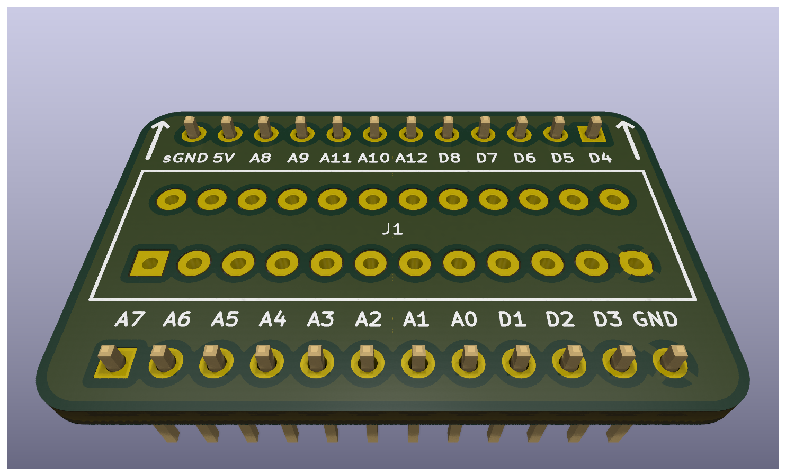

#WIP#

## ⚠️ Disclaimer

This project is provided **"as is"**, without warranty of any kind, express or implied,
including but not limited to the warranties of merchantability, fitness for a
particular purpose, and noninfringement.

This is a DIY electronics project intended for educational and experimental use.
Use at your own risk.

The author assumes **no responsibility or liability** for any damage, injury, or loss
resulting from the use or misuse of this design, including but not limited to:

* Damage to connected equipment (Eurorack modules, power supplies, computers, etc.)
* Incorrect assembly or wiring
* Use with incompatible voltages or signal levels
* Personal injury

### Electrical Safety

This project may interface with:

* ±12V Eurorack power rails
* External control voltages (CV)
* Digital and analog circuitry

Improper handling may result in damage or unsafe conditions.

You are responsible for:

* Verifying all connections before powering the system
* Ensuring correct polarity of power connections
* Confirming voltage ranges and signal compatibility
* Using appropriate protection circuits where necessary

### No Guarantees

Schematics, PCB layouts, and code are provided for reference only.
They may contain errors, omissions, or design flaws.

**Always review and validate the design before building or using it.**
